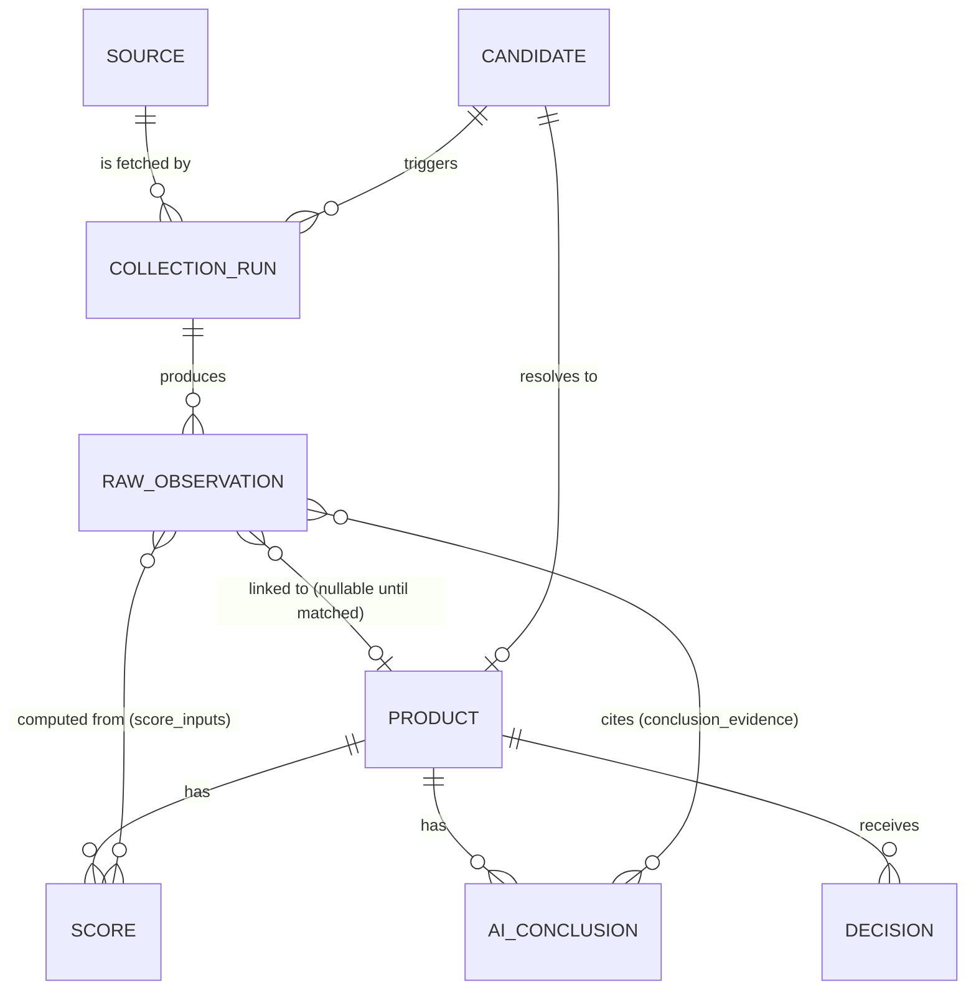

# Ecommerce Product Research & Decision System — Technical Foundation

**Status:** Draft for founder approval — no code has been written against this yet.
**Audience:** One non-technical founder + AI coding assistant.
**Last updated:** 2026-07-11

---

## 1. V1 Scope (precise)

V1 is a **single-user, local-first research pipeline** with an HTTP API. It does exactly this:

1. **Track products.** You (or an automated discovery job) register a "product candidate" — a product idea or a product spotted in the wild.
2. **Collect evidence.** For each candidate, the system pulls signals from a small set of pluggable sources and stores every response verbatim, with its source URL and timestamp.
3. **Normalize.** Observations from different sources are linked to one canonical product record (with manual override, because automatic matching will be imperfect).
4. **Score.** Deterministic, explainable scores are computed from collected data only: demand, competition, saturation, pricing/margin estimate, shipping difficulty, creative potential.
5. **Conclude.** An LLM reads the collected evidence (and *only* the collected evidence) and produces a structured verdict: **LAUNCH / WATCH / AVOID / INSUFFICIENT EVIDENCE**, with every claim citing evidence IDs.
6. **Serve.** A FastAPI backend exposes this via JSON endpoints. You interact through the API docs UI (`/docs`) until the dashboard exists.

**V1 source capabilities (only these):**

> ⚠️ **All external-source availability is UNVERIFIED until the Provider Access Spike (§8.1) is completed.** The rows below describe *desired capabilities* and *candidate implementation routes* — not guaranteed integrations. Every capability has manual evidence entry as a floor and "unavailable" as an honest terminal status.

| Capability | Candidate implementation routes (to be verified in the spike) | Why first |
|---|---|---|
| Meta ad intelligence | (a) an official Meta API **if our specific use case and access level support it** — the Ad Library API's scope, approval process, and dataset coverage for general ecommerce-ad search must be verified, not assumed; (b) a licensed third-party ad-intelligence provider; (c) manual evidence entry; (d) **unavailable** if no compliant route exists | Strongest "someone is spending money on this" signal |
| Search demand (trends) | (a) the official Google Trends API — currently **access-controlled/alpha; must not be assumed available**; (b) a licensed third-party trends provider (SerpApi/Glimpse class); (c) pytrends flagged `best_effort`/fragile; (d) manual entry; (e) unavailable. Provider choice stays configurable | Demand trajectory |
| Marketplace listings | (a) a licensed marketplace data provider (Keepa class — paid); (b) an official marketplace API if access requirements are met; (c) manual entry; (d) unavailable | Price, reviews, sales-rank proxy |
| Manual evidence | You paste URLs/screenshots/notes — always available, no external dependency | Covers everything without an API |

TikTok, Reddit, supplier APIs, review mining, and competitor-store analysis are **interface-defined in V1 but implemented later** (see §8). In particular, **TikTok Commercial Content API availability, geographic coverage, and approval requirements must be verified before any implementation work**.

## 2. Explicitly excluded from V1

- No authentication, users, teams, roles, billing, subscriptions, or multi-tenancy. The API binds to localhost / runs in Docker on your machine.
- No Next.js dashboard (Phase 7 — the FastAPI auto-generated docs UI is the interface until then).
- No TikTok, Reddit, supplier, review-mining, or competitor-store providers (interfaces only).
- No automated product *discovery* crawling — V1 candidates are entered manually or come from provider search endpoints you trigger.
- No supplier negotiation, offer building, landing pages, ad concepts, creative briefs, or launch planning (these are Phase 8+ modules that reuse the same evidence store).
- No queues/workers/Celery/Redis — provider fetches run as simple background tasks or CLI commands. We add a job queue only when fetch volume demands it.
- No microservices, Kubernetes, or cloud deployment. Docker Compose on one machine.
- No web scraping of sites whose Terms of Service prohibit it. If a source has no compliant path, the provider returns "unavailable" and the scores account for the missing signal.

## 3. Main user workflow

```
You spot a product (ad, TikTok, marketplace, gut feeling)
        │
        ▼
POST /candidates  { name, niche, seed URLs, notes }
        │
        ▼
POST /candidates/{id}/collect        ← triggers all configured providers
        │   each provider stores RawObservations (verbatim payload + URL + fetched_at)
        ▼
System links observations → canonical Product (you confirm/fix matches)
        │
        ▼
POST /products/{id}/score            ← deterministic scoring from stored data
        │   each score records its formula inputs (which observations it used)
        ▼
POST /products/{id}/analyze          ← LLM reads evidence bundle, returns
        │   structured verdict citing evidence IDs, or INSUFFICIENT_EVIDENCE
        ▼
GET /products/{id}/report            ← one document: facts, scores, AI verdict,
                                        every claim → evidence URL
        │
        ▼
You decide: launch / watch / avoid. Decision is stored, so later
outcomes can be compared against recommendations.
```

## 4. Architecture diagram

```mermaid
flowchart TB
    subgraph External["External sources (routes unverified until §8.1 spike)"]
        META[Meta ad intelligence<br/><i>route TBD</i>]
        TRENDS[Trends provider<br/><i>route TBD</i>]
        MKT[Marketplace provider<br/><i>route TBD</i>]
        FUTURE[TikTok / Reddit / Suppliers / Reviews / Stores<br/><i>interfaces only in V1</i>]
    end

    subgraph App["FastAPI modular monolith (one Python process)"]
        API[api — HTTP routes]
        ING[ingestion — orchestrates fetches]
        PROV[providers — one adapter per source<br/>behind a common interface]
        CAT[catalog — normalized products,<br/>dedup & matching]
        SCORE[scoring — deterministic metrics]
        AI[analysis — LLM conclusions<br/>via provider-agnostic client]
        REC[recommendation — verdict &<br/>report assembly]
        CORE[core — config, logging,<br/>errors, db session]
    end

    subgraph Data["PostgreSQL"]
        RAW[(raw_observations<br/>immutable, verbatim)]
        NORM[(products & links)]
        SC[(scores + inputs)]
        CONC[(ai_conclusions + evidence refs)]
    end

    LLM[LLM API<br/>Anthropic / OpenAI / other]

    META & TRENDS & MKT --> PROV
    API --> ING & CAT & SCORE & AI & REC
    ING --> PROV
    ING --> RAW
    CAT --> RAW & NORM
    SCORE --> NORM & RAW
    SCORE --> SC
    AI --> SC & RAW & NORM
    AI --> LLM
    AI --> CONC
    REC --> SC & CONC & NORM
```



## 5. Modules and ownership

One Python package `app/`, one module = one folder. Modules talk through Python function calls (it's a monolith), but each module owns its tables and other modules read them only through that module's service functions — this discipline is what keeps it *modular*.

| Module | Owns | Never does |
|---|---|---|
| `core` | Settings (pydantic-settings, env vars), logging setup, error types, DB engine/session, Alembic wiring | Business logic |
| `providers` | The `SourceProvider` interfaces + one adapter per external source; rate limiting, retries, compliance flags | Writing to the DB (returns DTOs only) |
| `ingestion` | Collection runs: which providers to call for a candidate, storing `raw_observations`, run status/errors | Interpreting the data |
| `catalog` | `products`, matching observations → products, dedup, manual merge/split | Fetching or scoring |
| `scoring` | Deterministic score computation; every score row stores the observation IDs and formula version used | Calling LLMs, inventing numbers when inputs are missing (emits `null` + reason instead) |
| `analysis` | LLM client abstraction (`complete(messages, schema) -> parsed`), evidence-bundle builder, structured conclusions | Fetching data; presenting conclusions as facts |
| `recommendation` | Assembling the final report; recording your actual decision for later comparison | — |
| `api` | FastAPI routers, request/response Pydantic schemas | Business logic (thin layer over module services) |

## 6. Initial database entities



- **source** — registry of configured providers: `key` (`meta_ads`, `google_trends`, …), compliance status, enabled flag.
- **candidate** — a product idea you registered: name, niche, seed URLs, free-text notes, status (`new/collecting/analyzed/decided`).
- **collection_run** — one execution of one provider for one candidate: status, started/finished, error text. This is your audit trail when a provider breaks.
- **raw_observation** — *immutable*. `payload` (JSONB, verbatim API response or manual entry), `source_url`, `fetched_at`, `source_id`, `run_id`, `observation_type` (`ad`, `trend_series`, `listing`, `manual_note`, …). Never updated, never deleted in normal operation.
- **product** — canonical normalized record: title, category, canonical attributes, price range. Built from observations; every normalized field can be traced back.
- **score** — `product_id`, `metric` (`demand`, `competition`, …), `value` (nullable!), `formula_version`, `computed_at`, `explanation`, plus a `score_inputs` join table listing the observation IDs used. **A score with no inputs cannot exist.**
- **ai_conclusion** — `product_id`, `verdict` (`launch/watch/avoid/insufficient_evidence`), structured `reasoning` (JSONB), `model`, `prompt_version`, `created_at`, plus `conclusion_evidence` join table citing observation IDs. Stored *separately* from scores and facts — the API always labels which layer data came from.
- **decision** — what *you* actually decided and (later) what happened. This is how we'll eventually measure whether the system is any good.

## 7. The four data layers (the most important idea in this document)

| Layer | What it is | Who writes it | Mutable? | Example |
|---|---|---|---|---|
| **1. Raw observation** | Verbatim external data + URL + timestamp | Providers only | Never | The exact JSON Meta returned for an ad, fetched 2026-07-11 |
| **2. Normalized product** | Cleaned, merged canonical record | Catalog module (+ your manual fixes) | Yes, with traceability | "LED Dog Collar — pet niche — seen on Meta + Amazon" |
| **3. Calculated score** | Deterministic math over layers 1–2. Reproducible: same inputs + same formula version → same number. `null` when inputs are missing. | Scoring module | Append-only (recompute = new row) | demand = 72/100, formula v3, from observations #14, #15, #22 |
| **4. AI conclusion** | LLM interpretation of layers 1–3. An *opinion*, always cited, allowed to say "insufficient evidence". | Analysis module | Append-only | "AVOID: 40+ near-identical Meta ads (obs #14…#31) indicate saturation" |

Rules enforced in code, not just convention:

- Layer N may only be derived from layers ≤ N.
- The LLM prompt contains **only** serialized evidence from the DB — never asked to "estimate" a number the system didn't collect. The structured output schema has no free-numeric fields; any metric it mentions must reference an evidence ID, and responses failing validation are rejected and retried once, then flagged.
- API responses tag every field with its layer, so the future dashboard can visually separate fact from opinion.

## 8. Source-provider interface design

One narrow interface per *capability*, not one giant interface per website. A provider implements the capabilities it can serve. Written as Python `Protocol`s with Pydantic DTOs (illustrative — final signatures at implementation time):

```python
class ProviderInfo(BaseModel):
    key: str                    # "meta_ads"
    display_name: str
    compliance: Literal["official_api", "licensed_data", "manual", "best_effort"]
    cost_note: str              # "free", "$49/mo", "per-request"

class AdObservation(BaseModel):     # DTOs carry evidence fields ALWAYS
    source_url: str
    fetched_at: datetime
    payload: dict               # verbatim
    # + typed convenience fields: advertiser, first_seen, media_type...

class AdIntelProvider(Protocol):            # candidate routes: Meta official API (if
    info: ProviderInfo                      # approved for our use case), licensed
                                            # third party, TikTok Commercial Content API
                                            # (availability/geo/approval unverified)
    def search_ads(self, query: str, country: str, limit: int) -> list[AdObservation]: ...

class TrendsProvider(Protocol):             # candidate routes: official Google Trends API
                                            # (access-controlled/alpha — not assumed),
                                            # SerpApi/Glimpse class, pytrends (best_effort)
    def interest_over_time(self, term: str, geo: str, months: int) -> TrendObservation: ...
    def related_queries(self, term: str, geo: str) -> list[TrendObservation]: ...

class MarketplaceProvider(Protocol):        # candidate routes: Keepa, Rainforest,
                                            # later AliExpress — all unverified
    def search_listings(self, query: str, limit: int) -> list[ListingObservation]: ...
    def get_listing(self, listing_id: str) -> ListingObservation: ...

class ReviewProvider(Protocol):             # usually piggybacks on marketplace providers
    def get_reviews(self, listing_ref: str, limit: int) -> list[ReviewObservation]: ...

class SupplierProvider(Protocol):           # CJ Dropshipping API, AliExpress affiliate API
    def search_suppliers(self, query: str) -> list[SupplierObservation]: ...

class CompetitorStoreProvider(Protocol):    # only compliant paths; else returns Unavailable
    def analyze_store(self, store_url: str) -> StoreObservation: ...

class CommunityProvider(Protocol):          # Reddit official API
    def search_mentions(self, query: str, limit: int) -> list[MentionObservation]: ...
```

Shared behavior every adapter gets from a small base class:

- **Registry:** providers register under their `key`; ingestion asks the registry "who implements `TrendsProvider`?" — swapping SerpApi for Glimpse is a config change, no caller changes.
- **Graceful absence:** a provider may raise `ProviderUnavailable(reason)`; ingestion records it on the `collection_run` and moves on. Missing data is a recorded fact, not an exception that kills the run.
- **Rate limiting + retry with backoff**, per-provider config from env vars.
- **No DB access.** Providers return DTOs; only `ingestion` persists. This keeps every provider trivially testable with recorded fixture responses.
- **Compliance flag surfaced** in every report, so you always know which signals came from official APIs vs. best-effort sources.

### 8.1 Provider Access Spike (mandatory gate before any real provider)

No real external provider gets implemented — not even a prototype — until it has passed a **Provider Access Spike**. The spike is a short, structured investigation producing one record per proposed provider, stored in the repo (`docs/providers/<key>.md`) so decisions are auditable. Each record must contain:

1. **Official documentation URL.**
2. **Registration/approval requirements** — developer account, app review, business verification, waitlist, etc.
3. **Regions and datasets covered** — exactly which countries and which data fields we would actually get.
4. **Rate limits.**
5. **Pricing** — including free-tier boundaries and overage behavior.
6. **Allowed use and storage restrictions** — can we store responses? For how long? Any display/attribution requirements? Any prohibition on our use case?
7. **A successful minimal test request** (request + redacted response captured), *if* access is available at spike time.
8. **Fallback provider options** if this route fails.
9. **Final status:** `usable` / `blocked` / `paid_option` / `manual_only`.

Rules:

- A provider adapter may only be built for a source whose spike record concludes `usable` or an accepted `paid_option`.
- `blocked` or unresolved sources fall back to the manual provider, and reports show that signal as unavailable — the system stays honest rather than assuming access.
- Spike records are re-checked when a provider errors persistently (API terms and access programs change).

## 9. Risk register

| # | Risk | Likelihood | Impact | Mitigation |
|---|---|---|---|---|
| R1 | **API access changes/revocation/never-granted** (Meta app review, TikTok API access is regionally limited, official Google Trends API is access-controlled/alpha, Amazon PA-API requires affiliate sales) | High | High | Provider Access Spike (§8.1) gates every adapter; provider interface = every source replaceable; prefer paid licensed data over fragile free routes; manual-entry provider as universal fallback |
| R2 | **Scraping limitations** — many targets (AliExpress, TikTok organic, Shopify stores) prohibit scraping in ToS | High | Medium | Default stance: no scraping. Use official/licensed APIs or record "signal unavailable". Any best-effort source is flagged `best_effort` and never load-bearing for a verdict |
| R3 | **Data quality** — stale trends, geo mismatch, bot-inflated engagement | Medium | High | Store `fetched_at` everywhere; scores decay/expire; formulas versioned so bad formulas can be recomputed; outlier flags rather than silent correction |
| R4 | **Duplicate products** — same item under 20 names/SKUs across sources | High | Medium | Matching is *assistive, never silently automatic*: system proposes links, you confirm; merge/split operations preserve observation history |
| R5 | **Unreliable metrics** — e.g. "ad count" ≠ "ad spend"; sales rank ≠ sales | High | High | Every score ships with an `explanation` and named proxy limitations; scores are ordinal guidance (0–100) not dollar predictions; `null` + reason when inputs are weak |
| R6 | **AI hallucination** | Medium | High | Layer separation (§7); structured output validated against schema; citations mandatory per claim; `INSUFFICIENT_EVIDENCE` is a first-class verdict; conclusions never overwrite facts |
| R7 | **Operating costs creep** (data APIs + LLM tokens) | Medium | Medium | Per-provider cost notes; collection is on-demand (no always-on crawlers) in V1; LLM called once per analyze request on a compact evidence bundle; token/request counts logged per run |
| R8 | **Solo-founder bus factor / complexity debt** | Medium | High | Modular monolith, boring tech, tests + migrations from day one, this document kept current |

## 10. Phased implementation order (dependency-driven, no dates)

Each phase is shippable and testable on its own; each depends only on the phases above it.

1. **Phase 0 — Skeleton.** Repo layout, Docker Compose (Postgres + API), FastAPI app with `/health`, settings from env, structured logging, Alembic baseline migration, pytest wired up, `.env.example`, README.
2. **Phase 1 — Evidence store.** Tables from §6; CRUD for candidates; the **manual provider** (paste a URL/note → raw_observation). *The system is already useful as a disciplined research notebook.*
3. **Phase 2 — Provider Access Spike (§8.1).** Investigate and document every proposed provider (Meta ad intelligence routes, trends routes, marketplace routes, TikTok, Reddit, suppliers). Output: one spike record per provider with a final status. **No adapter code is written in this phase.**
4. **Phase 3 — First real providers.** Provider interface + registry; adapters **only for sources whose spike record is `usable` or an accepted `paid_option`**; `collection_run` orchestration; recorded-fixture tests.
5. **Phase 4 — Catalog.** Normalization, propose-and-confirm matching, merge/split.
6. **Phase 5 — Scoring.** Formula-versioned deterministic scores with input tracking and null-handling.
7. **Phase 6 — Analysis.** LLM client abstraction (Anthropic + OpenAI implementations behind one interface), evidence-bundle builder, structured cited conclusions, INSUFFICIENT_EVIDENCE path.
8. **Phase 7 — Recommendation & report.** Report assembly endpoint; decision recording.
9. **Phase 8 — Dashboard.** Next.js app reading the existing API.
10. **Phase 9+ — Expansion.** More providers (each gated by its own spike record); supplier research, offers, creative briefs, launch planning — each as a new module reusing the evidence store.

Milestone M0 (§12) sits in Phase 0 and **does not call any real external provider**.

## 11. Local development tools to install

1. **Docker Desktop** (Mac/Windows) or Docker Engine + Compose plugin (Linux) — runs Postgres and the app identically everywhere.
2. **Python 3.12+** — for running tests/scripts outside Docker.
3. **uv** (fast Python package manager; replaces pip/venv juggling).
4. **Git** + a GitHub account (you have both).
5. **VS Code** with the Python extension — you'll mostly read code and run commands here.
6. **A Postgres client** — TablePlus (nice GUI) or the `psql` CLI, for looking at your data directly.
7. That's all. No Node.js until Phase 7, no cloud accounts until we deploy.

## 12. First coding milestone (after your approval)

**Milestone M0 — "the skeleton boots":**

- Repo structure: `app/{core,api}` (other module folders created empty with `README.md` stubs stating ownership), `tests/`, `migrations/`, `docker-compose.yml`, `pyproject.toml`.
- `docker compose up` starts Postgres + the API; `GET /health` returns `{status: "ok", db: "connected"}`.
- Settings loaded from environment variables via pydantic-settings; `.env.example` documents every variable; no secret ever committed.
- Alembic configured with migration #1 creating `sources`, `candidates`, `collection_runs`, `raw_observations`.
- Structured JSON logging and a global error handler.
- `pytest` green with: a health-endpoint test, a settings test, and a migration round-trip test.
- README: how to start, migrate, test — written for you.

Definition of done: you personally run three commands (`docker compose up`, `uv run pytest`, open `/docs`) and all three work. Roughly 15–20 files.

---

## Appendix A — Recommended final stack

| Concern | Choice |
|---|---|
| Language / runtime | Python 3.12 |
| Web framework | FastAPI |
| Data validation | Pydantic v2 (+ pydantic-settings for config) |
| Database | PostgreSQL 16 (JSONB for raw payloads) |
| ORM / migrations | SQLAlchemy 2.0 + Alembic |
| Packaging | uv + pyproject.toml |
| Local infra | Docker Compose (Postgres + API) |
| HTTP client | httpx |
| Testing | pytest + recorded provider fixtures |
| Lint/format | ruff |
| LLM access | Thin in-house abstraction; Anthropic first, OpenAI second implementation |
| Dashboard (later) | Next.js + TypeScript, plain REST |
| Job queue | **None in V1** — FastAPI background tasks / CLI; revisit only if fetch volume demands it |

## Appendix B — The five most important architectural decisions

1. **Four strictly separated data layers** (raw → normalized → scored → AI opinion), each derivable only from the layers below it. This single rule is what prevents hallucinated metrics and makes every recommendation auditable.
2. **Immutable, verbatim raw observations with URL + timestamp** as the foundation of everything — reprocessing, re-scoring, and re-analyzing are always possible because the original evidence is never lost.
3. **Capability-based provider interfaces with graceful absence** — every external source is swappable via config, and "this signal is unavailable" is recorded data rather than a crash or a guess.
4. **Modular monolith with module-owned tables** — one process, one database, near-zero ops, but module boundaries strict enough that any module could be extracted later if ever needed.
5. **LLM as cited interpreter, never as data source** — structured output, mandatory evidence citations, schema validation, and INSUFFICIENT_EVIDENCE as a first-class verdict.

## Appendix C — The five biggest risks

1. **Data-source access** (R1/R2): the best signals live behind restrictive APIs and anti-scraping terms; some signals may simply be unobtainable compliantly, and the system must stay honest about that.
2. **Proxy-metric overconfidence** (R5): ad counts, trend curves, and sales ranks are proxies; treating scores as predictions instead of ordinal guidance would lead to bad launch decisions.
3. **AI hallucination / overreach** (R6): mitigated by architecture, but prompt or schema regressions could quietly weaken the guarantees — tests must cover the validation path.
4. **Duplicate/mismatched products** (R4): wrong matching silently corrupts every downstream score; that's why matching stays human-confirmed in V1.
5. **Scope creep vs. one founder** (R8): the system's ambition (12+ sources, launch planning, creatives) far exceeds V1; the phase discipline in §10 is the defense.
