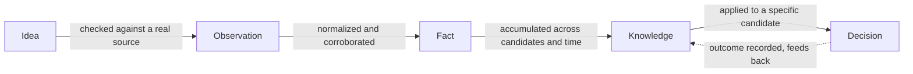

# OPERATING_SYSTEM.md — How Atlas Operates

**Status:** Target-state design. Not yet implemented.
**Last updated:** 2026-07-11

## What this document is, and how it relates to the others

Three documents now define Atlas, each at a different altitude:

- **`FOUNDATION.md`** is the technical architecture — what gets built, in
  what modules, in what order.
- **`AGENTS.md`** is the organizational constitution — who does the work,
  with what mandate, and how the organization of agents relates to Ahmed.
- **`OPERATING_SYSTEM.md` (this document)** is the runtime philosophy — how
  work actually moves through Atlas moment to moment, regardless of which
  agent or which technology is doing it.

This document contains no implementation details: no code, no schemas, no
named frameworks, no database tables. It defines *concepts* — the lifecycle
of work, the event system, memory, the decision hierarchy, and the
invariants every future implementation must satisfy, no matter how it's
built. It does not modify `FOUNDATION.md` or `AGENTS.md`; it is the third
pillar they both operate within.

---

## 1. The Lifecycle of Work

Everything Atlas produces travels through the same five stages. Nothing
skips a stage, and nothing is trusted more than the stage it came from
allows.

- **Idea.** An unverified hypothesis that something might be worth looking
  at — a Scout Agent noticing a pattern, a manual lead Ahmed enters. An idea
  costs nothing and carries no evidentiary weight. It is disposable by
  design: most ideas should die here, cheaply, without ever touching the
  Evidence Store.
- **Idea → Observation.** The moment an idea is checked against a real,
  citable source and something with provenance is captured — a URL, a
  payload, a timestamp. This is the only door between speculation and
  evidence. Nothing becomes an observation without a source.
- **Observation → Fact.** A single observation is one data point. A fact is
  what emerges once observations are normalized and, where the claim
  matters, corroborated by more than one independent observation — a
  resolved product identity, a confirmed unit cost. A fact always remains
  traceable to the observations beneath it.
- **Fact → Knowledge.** Facts are per-candidate. Knowledge is what Atlas
  learns *across* candidates and *across* time — that a category tends to
  saturate within a certain window of first ad activity, that a given
  formula version has proven more reliable than its predecessor, that a
  supplier's quoted shipping times have historically held up. Knowledge is
  derived from many facts and many past decisions; it is never a
  substitute for checking today's facts.
- **Knowledge → Decision.** A decision applies today's facts, informed by
  accumulated knowledge, to a specific candidate, producing a verdict with a
  confidence level and a citation trail. A decision is never knowledge
  itself — it is knowledge and fact, applied once, to one case.
- **The loop closes.** What actually happens after a decision — did a
  launch work, did a watch item turn into an opportunity, did Ahmed
  disagree with a verdict — is itself recorded and becomes part of the
  facts that future knowledge is built from. Atlas learns by accumulating
  a longer, better history, not by silently changing its own rules.

---

## 2. The Event System

Everything inside Atlas happens because of an event. No agent polls for
work, and no agent calls another agent directly — an agent's work begins
when it consumes an event, and its result is announced as a new event for
whoever needs to know. This is the same discipline `AGENTS.md` describes for
inter-agent communication, stated here as the system-wide mechanism that
makes it true.

An event is an immutable, timestamped record that something happened. It is
never a command — no event tells another agent what to conclude, only what
has occurred and where to find the details. Every event has exactly one
producer, zero or more consumers, and a persistence and retry behavior
appropriate to what it represents. The list below is illustrative, not
exhaustive: new capability is added by introducing new event types, never
by repurposing an existing one to mean something else (see §7).

| Event | Producer | Consumers | Payload (conceptual) | Persistence | Retry behavior |
|---|---|---|---|---|---|
| **NewProductDiscovered** | Scout Agent | Trend Agent, Market Signal Agent, Product Intelligence Agent | Candidate reference, seed evidence citation(s), discovery source | Permanent — part of the historical record of how a candidate entered Atlas | Not retried as an action; if a consumer fails to process it, the event stays pending and is retried under the standing reasoning-failure policy until it succeeds or is recorded as failed |
| **EvidenceCollected** | Any Discovery/Research agent that successfully stores a new observation | Product Intelligence Agent, the Analysis agent(s) whose inputs include that evidence type, the Evidence Ledger | Reference to the new observation (not a duplicate copy), source, compliance classification | Permanent — mirrors the underlying observation's permanence | The underlying collection attempt follows the transient-failure retry policy; once evidence exists, a missed event is recovered by replaying from the Evidence Ledger, not by re-doing the research |
| **EvidenceChanged** | Any agent that observes a new observation superseding a prior one for the same fact | Analysis agents whose prior rating depended on the superseded observation, Opportunity Agent | Reference to the old observation, reference to the new one, which fact-type changed | Permanent — the record of why a score was recomputed | If a consumer fails to react, the reasoning-failure retry policy applies; if retries are exhausted, the affected score is marked stale rather than left looking current |
| **ProviderFailed** | Any agent attempting to use a provider that errors, times out, or reveals a compliance regression | CEO Agent (health aggregation), the failing agent's own retry logic, the Escalation queue if the pattern crosses threshold | Which provider, which agent, nature of failure (transient vs. structural), timestamp | Permanent — part of that provider's reliability history, relevant to future Provider Access Spike re-verification | Triggers the transient-failure retry policy on the underlying request; repeated events for the same provider in a short window trigger escalation, not the event itself |
| **TrendDetected** | Trend Agent | Product Intelligence Agent, Saturation Agent, Opportunity Agent | Candidate/category reference, direction, time window, confidence | Permanent — a fact about a point in time; later reads supersede it for "current" but don't erase it | Standard collection retry policy; if detection can't complete, no event fires and the gap is recorded as "not assessed," never silently absent |
| **SupplierFound** | Supplier Agent | Margin Agent, Logistics Agent, Opportunity Agent | Candidate reference, sourcing observation reference, provider compliance classification | Permanent | Collection-level retry policy; if no match is found after retries, no event fires and the gap is explicit |
| **CompetitionUpdated** | Competition Agent | Saturation Agent, Margin Agent, Opportunity Agent, Positioning Agent | Candidate reference, competitor-landscape observation reference, marketplaces/locales covered | Permanent | Collection-level retry policy; partial coverage is recorded and emitted as such rather than waiting indefinitely for full coverage |
| **OpportunityCreated** | Opportunity Agent | Auditor Agent (mandatory) | Candidate reference, verdict, confidence, cited rationale reference | Permanent — even a rejected or downgraded opportunity stays in Decision History | Not retried as a request; an inability to reach a confident verdict is itself a valid INSUFFICIENT_EVIDENCE verdict and a valid event, not a missing one |
| **OpportunityRejected** | Auditor Agent | CEO Agent (escalation queue if repeated), Opportunity Agent (informational only) | Candidate reference, original opportunity reference, specific rejection reason, resulting disposition | Permanent — feeds the "same candidate rejected twice" escalation trigger | Not retried; a rejection is final for that verdict attempt, a new attempt only follows new evidence (a fresh EvidenceCollected/EvidenceChanged event) |
| **MorningReportGenerated** | CEO Agent | Ahmed (terminal consumer — no agent consumes this downstream) | Reference to the day's approved opportunities, watch list, insufficient/avoid summary, escalation entries, system health note | Permanent — every report is retained in Decision History, forming the track record the trust ladder depends on | Report assembly has a bounded retry on failure; if the day was degraded, that is what gets reported — the report itself is never silently skipped |

---

## 3. Memory

Atlas has two kinds of memory: what it needs only for right now, and what it
keeps forever.

- **Working Memory.** The scratch space for a single run — a candidate's
  current pass through the pipeline, an Analysis agent's in-progress
  computation, an Opportunity Agent's draft rationale before Audit. Nothing
  in Working Memory is trustworthy until it is committed to Long-term
  Memory. If a run is interrupted, Working Memory is discarded and safely
  recomputed — it holds no fact that doesn't already exist, durably,
  somewhere else.
- **Long-term Memory.** Everything durable in Atlas, composed of exactly
  three specialized stores. Nothing is remembered long-term outside them:
  - **Evidence Store.** Raw observations and normalized product identity,
    with full provenance. The permanent factual bedrock. Nothing here is
    ever edited — only superseded by a new observation, with the old one
    left standing.
  - **Knowledge Base.** Generalized understanding accumulated across many
    candidates and many decisions over time — provider reliability history,
    formula-version track records, category-level heuristics that have
    actually held up. Everything in the Knowledge Base must be traceable
    back to the Evidence Store and Decision History it was derived from; it
    is a cache of derived understanding, not an independent source of
    truth, and it is always in principle recomputable from what produced
    it.
  - **Decision History.** Every verdict ever produced, every audit
    disposition, every escalation and its outcome, every morning report —
    permanent and append-only. A decision that turns out wrong is never
    erased; a new entry records the correction. This is what makes the
    trust-ladder evolution in `AGENTS.md` possible: autonomy can only
    expand based on a track record that is actually there to examine.

---

## 4. Decision Hierarchy

Every claim inside Atlas belongs to exactly one of five layers. The layer
determines how much it can be trusted and whether it is permanent or must
be recomputed.

1. **Facts** — *permanent, in both senses: the record never disappears, and
   the fact itself doesn't expire.* Raw observations and normalized product
   identity. Nothing above this layer is ever treated as more certain than
   the facts it rests on.
2. **Derived Metrics** — *recomputable, not permanent.* Anything mechanically
   computed from Facts by a versioned, deterministic formula — a margin
   range, a logistics flag drawn directly from specs. Given the same Facts
   and the same formula version, a Derived Metric always reproduces
   identically, so it can always be thrown away and rebuilt. It is kept
   historically because a decision was made using it, not because it is
   itself irreplaceable.
3. **Agent Opinions** — *recomputable, not permanent, always labeled.*
   Judgment calls that require reasoning rather than a formula —
   brandability, an unconfirmed risk flag, a positioning proposal. Always
   versioned by the model and prompt that produced them, always expected to
   change on a fresh run, and never mistaken for a Fact no matter how many
   times it's repeated.
4. **Consensus** — *recomputable.* The point where Derived Metrics and
   Agent Opinions are reconciled under the weakest-constraint rule and any
   standing veto (`AGENTS.md`'s Risk Agent authority) into one coherent
   evidentiary position for a candidate. Consensus is not yet a decision —
   it is what the Opportunity Agent works from before a verdict is drawn.
5. **Executive Decision** — *permanent as history, never permanent as
   current truth.* The audited verdict that reaches the CEO Agent and,
   eventually, Ahmed. Once made, it is recorded forever in Decision
   History — it is never erased or edited. But it is not eternal guidance:
   new Facts produce a new Executive Decision alongside it, never a rewrite
   of the old one.

The distinction to hold onto: **Facts are permanent as truth. Everything
above Facts is permanent only as history** — the record of having decided
something stays forever, but the decision itself is always subject to being
superseded the moment the Facts it rested on change.

---

## 5. How Atlas Avoids Hallucination

No single mechanism prevents fabrication — a stack of them does:

- **Nothing enters the system without a citation.** An observation without
  a source cannot become a Fact; a claim without a citation cannot leave any
  agent. This is structural, not a matter of agent discipline.
- **Every output is labeled by layer.** A consumer — another agent, the
  Auditor, Ahmed — always knows whether it's looking at a Fact, a Derived
  Metric, an Agent Opinion, Consensus, or an Executive Decision. A
  hallucination has nowhere to hide as a fact, because facts are the one
  layer with the narrowest, most mechanical path into existence.
- **Audit is independent, not self-attested.** The Auditor Agent re-checks
  citations against the underlying Evidence Store itself — it does not
  trust the Opportunity Agent's description of what the evidence says.
- **"I don't know" is never penalized.** Every agent in `AGENTS.md` has an
  explicit, legitimate path to declaring insufficient evidence. There is no
  incentive, anywhere in the organization, to produce a confident-sounding
  answer over an honest gap.
- **Confidence is capped by the weakest load-bearing input**, not averaged.
  A single unsupported or thin claim buried among strong ones cannot
  inflate an overall verdict — every load-bearing claim is checked, because
  every load-bearing claim can single-handedly cap the result.
- **Opinions are never laundered into facts.** No agent may treat another
  agent's opinion as ground truth just because it's been repeated or
  because multiple agents happen to agree. Agreement between opinions is
  Consensus, not a Fact.
- **Corroboration is required before a pattern is claimed.** A single
  mention is never presented as a trend or theme (per Customer Voice
  Agent's rule in `AGENTS.md`) — this specifically guards against an LLM's
  tendency to generalize from one data point.
- **Provenance and compliance classification travel with every fact.** A
  claim can always be traced to a specific, named, compliance-checked
  source — not "some evidence," but *this* evidence, from *this* provider,
  fetched at *this* time.

---

## 6. From Deterministic Rules to AI-Assisted Reasoning, Without Changing the Architecture

The architecture — events, memory tiers, the decision hierarchy, agent
boundaries — does not know or care *how* an agent computes its output, only
*what layer* that output belongs to and *what contract* (inputs, outputs,
evidence rules, confidence rules) it satisfies. This is the seam that lets
Atlas grow more sophisticated without ever needing a redesign:

- A Margin Agent that starts as a deterministic, spreadsheet-style formula
  can later incorporate AI-assisted judgment — interpreting an ambiguous
  supplier listing, say — without changing what event it consumes, what
  event it produces, or who consumes its output. Only its internal method
  changes.
- If an agent's output genuinely shifts in nature — from purely mechanical
  to judgment-based — its layer classification moves honestly from Derived
  Metric to Agent Opinion. That reclassification is visible and governed by
  this document; it is never hidden behind an unchanged label.
- Every computed value already carries a formula or prompt version. This
  versioning *is* the upgrade mechanism: a new version is introduced, old
  outputs remain attributed to the old version, the two can be compared
  side by side using Decision History, and a regression is rolled back
  exactly like reverting a formula change — without touching any other
  agent.
- The event system reinforces this by design: a consumer of
  `CompetitionUpdated` reacts to the event and the referenced observation,
  never to whether Competition Agent used a hand-written parser or an LLM
  to interpret marketplace listings.
- What never changes as reasoning grows more capable: the duty to cite
  evidence, to label confidence honestly, and to never claim more certainty
  than the evidence itself supports. The reasoning method is swappable. The
  discipline around it is not.

---

## 7. Adding New Providers and New Agents Without Modifying Existing Ones

**New providers** follow the mechanism `FOUNDATION.md` §8 and §8.1 already
establish: a provider is an interchangeable implementation of a capability
interface, registered under its own key, gated by the Provider Access Spike
classification before anything may rely on it. A new provider feeding
Supplier Agent doesn't create a new event type — it produces more
`SupplierFound` events with a different source citation. No existing
provider or agent needs to change.

**New agents** are added the same additive way, because agents only ever
communicate through events and shared memory, never directly:

1. Define the new agent's charter using the template in `AGENTS.md` —
   purpose, responsibilities, inputs, outputs, allowed and forbidden
   evidence, downstream agents, confidence requirements, failure
   conditions, and when it says "I don't know."
2. Declare which existing events it consumes.
3. Declare what new event(s), if any, it produces.

No existing agent needs to be told the new agent exists. Existing agents
keep emitting exactly the events they always did; the new agent simply
starts listening. If an existing agent should benefit from the new agent's
output, that is an *additive* change to its input list — one more event
type it now also consumes — never a rewrite of what it already does.

For example (illustrative, not a commitment): a future Regulatory Agent
checking import/export compliance would consume `EvidenceCollected` and
`SupplierFound` events and produce a new `RegulatoryFlagged` event. Risk
Agent would then be extended to also consume `RegulatoryFlagged` — one line
added to its input list, not a redesign of Risk Agent or a change to how
Supplier Agent operates. The same discipline applies to expanding coverage
within an existing agent (a new marketplace inside Competition Agent's
existing contract, for instance) — additive capability, not a new agent or
a breaking change elsewhere.

The constraint that keeps this true indefinitely: **no agent may assume a
fixed, closed universe of producers or consumers.** An agent's contract is
defined by what events it needs and what it promises to produce — never by
which other specific agents happen to exist today.

---

## 8. What "Autonomous" Means Inside Atlas

**Autonomous** means Atlas can complete the full lifecycle of work — idea →
observation → fact → knowledge → decision — for a given day without a human
needing to initiate, guide, or unblock any step of that loop.

It does **not** mean Atlas acts on its decisions without oversight, and it
does **not** mean Atlas is exempt from anything in this document or in
`AGENTS.md`. Autonomy is about not needing a human to *operate the
machinery* — it is not about being unaccountable for what the machinery
produces. Every autonomous decision remains fully evidenced, fully
auditable, fully logged in Decision History, and confined to whatever
guardrails Ahmed has currently set.

Autonomy expands only along the trust ladder defined in `AGENTS.md`, and it
never extends to the categories of action that document permanently
reserves for explicit human authorization. The distinction that matters:
"doesn't need a human to run" is not the same claim as "isn't accountable to
a human," and Atlas's autonomy is only ever the first.

---

## 9. Principles Every Future Implementation Must Satisfy

1. No fact enters the system without a traceable citation.
2. No opinion is ever presented as a fact — every output is labeled by its
   layer in the decision hierarchy.
3. No permanent record is edited — only superseded, with full history
   preserved.
4. No agent communicates outside the event system and shared memory — there
   is no private, off-record coordination between agents.
5. No confidence claim exceeds the confidence of its weakest load-bearing
   input.
6. No provider is used outside its current Provider Access Spike
   classification.
7. "I don't know" is always an available, unpenalized output at every
   layer, for every agent.
8. Swapping deterministic logic for AI-assisted reasoning inside an agent
   requires a version bump, never an architecture change.
9. Adding a new provider or a new agent requires only an additive
   extension — never a modification to an existing agent's or provider's
   contract.
10. No autonomous action crosses from research-and-decision into money
    movement or third-party representation without an explicit amendment
    to `AGENTS.md` by Ahmed.
11. Autonomy expands only on an observed track record recorded in Decision
    History — never on a calendar.
12. Every escalation states what is uncertain and what the system would do
    about it, without doing it.

---

## 10. What Should Never Be Automated

Regardless of how far Atlas's autonomy grows along the trust ladder, the
following remain permanently outside it, until and unless Ahmed amends
`AGENTS.md` to say otherwise:

- Placing a supplier order or otherwise spending money with a supplier.
- Spending advertising budget.
- Publishing or submitting anything to a third-party platform (an ad, a
  storefront listing, a marketplace submission) on Ahmed's behalf.
- Communicating with any external party — supplier, platform, customer,
  reviewer — in a way that represents Atlas or Ahmed.
- Registering for a new provider, accepting its terms, or paying for it —
  even one Atlas itself recommends. Account creation and contractual
  acceptance remain a human act.
- Overriding a Risk Agent veto.
- Deleting or editing a permanent record — Facts and Decision History are
  corrected only by superseding, never by erasure.
- Amending `AGENTS.md` or this document. Only Ahmed changes the rules Atlas
  operates under.
- Expanding its own autonomy. The trust-ladder stage Atlas currently
  operates at is a setting only Ahmed changes — Atlas never promotes itself
  to a more autonomous stage based on its own read of its performance.
